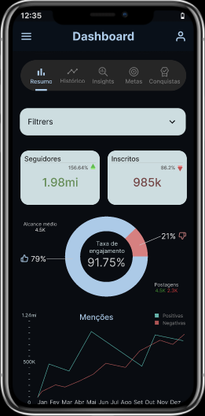

# Desafio de projeto DIO - Criando um protótipo navegável
O objetivo do projeto é criar um design partindo desde o wireframe até um mockup navegável.

#### Requerimentos
- [x] Criar um wireframe de média fidelidade.
- [x] Aplicar List View e/ou Grid View.
- [x] Criar os componentes.
- [x] Criar protótipo navegável.

[Ver protótipo](https://www.figma.com/proto/H5XSM9lxZKktzyehgoAml8/dashboard?node-id=0-1&t=JOxasyTBW5NJAHJZ-1)
